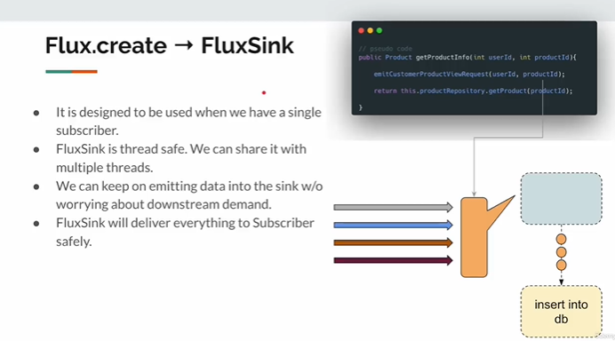

[//]: # (# Reactive Programming masterclass)
 

There are two types of Reactive stream:

Mono 

Flux

Reactive Stream Specification:
    Reactive Streams:  Reactive Stream is an

initiative to provide an **_asynchronous stream processing with non-blocking backpressure._**

 **On Thing please remember:** In Reactive Programming,
 
we have to do Subscribe + Request. without Request, Subscription will not work;

Publish and Subscribe communication terminology:

1. Subscriber will request for data to Publisher.
2. Publisher will accept the Subscriber and send back and Subscription Object
3. Using this Subscription Object, and received the values.
4. There are 3 state of Publisher: onNext(), onError(), onComplete().
5. onNext(): Publisher will continuously publish the data using this method
6. onComplete(): when data send is completed and or no data left, publisher will trigger this method:
7. onError(): If Publisher faces any issues/error while publishing data, it will trigger this state. 

Terminologies:

    Publisher:
        Source
        Observable
        Upstream
        Producer

    Subscriber
        Sink 
        Observer
        Consumer
        Downstream

    Process
        Operator

    Pillar of Reactive programming:
        Stream of message
        non-blocking
        asynchronous
        backpressure

Stream Lazy: If we do not have terminal operator , then stream operator will not execute
#### Mono Subscribe overloaded
[Lec03MonoSubscribe.java]

#### Creating default Subscriber
[DefaultSubscriber.java & Util.java]

#### Mono Empty/Error
[Lec04MonoEmptyError.java]

#### onError Dropped Problem
getUsername(34).subscribe(
s -> System.out.println(s)
); //onNext()

The console fays "Operator called default onErrorDropped" what is this meaning? ans: dont be panic
actually. It is what the reactor says that, hey you have subscribed to a publisher, that publisher did not give
any item, instead it gives one error message. you have provided only the data handler --subscribe(
s -> System.out.println(s)
); what about the error handler? you have not provided any error handler so, I did not know what to do with this error
Soln:
subscribe(
s -> System.out.println(s),
err -> {}
);

#### Mono - From Supplier

Mono.just() - just() can be use when, whatever you want to send, that value
is already in the memory. for CPU task.

to delay the execution we will use Mono.fromSupplier()
Mono.fromSupplier() -> If you want to delay the CPU intensive operation
then we can use fromSupplier().

#### Mono - From Callable

Callable vs Supplier:
Callable: to wrap the behavior, to sum it as a task to get that executed by an executor service
it throw exception.

Supplier: Supplier will not throw exception. it can throw runtime exception but it does not have
checked exception.

#### Mono - From Runnable:
If you want to do some method invocation(ex: product 3tar niche neme geche druto admin k notify korte hbe), only after method invocation
if you have to send the empty then we can use Runnable.
emitting empty after some method invocation.

#### Mono - Defer:
This will be useful if you want to delay the Publisher creation.

we are assuming that Publisher is not a time-consuming operation.

 

#### Non-Blocking IO client (reactor netty HttpClient:
(a) what is EventLoopGroup:
(b) what is LoopResources:
(c) what is ByteBuffer: ByteBuffer is a container of bytes.
(d) what is ByteBufFlux: FLux of byte buffer.

# Flux - Emitting Items programmatically:

### Flux Sink

 